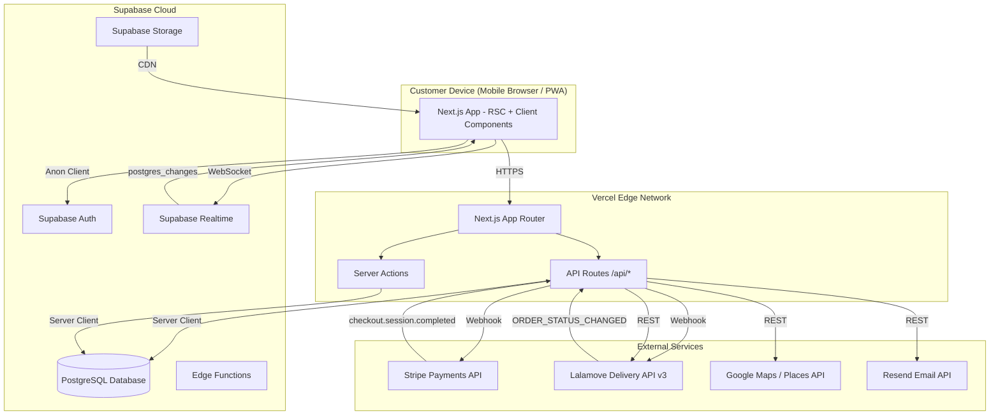

# architecture.md — Mad Krapow D2C: System Architecture

This document describes the high-level architecture, key design decisions, component map, and data flows.
It should be read alongside plans.md (execution plan) and referenced by implement.md.
Keep this aligned with the codebase as it evolves; revisit quarterly.

---

## Bird's-Eye View

Mad Krapow is a single-restaurant D2C food ordering web app. The customer visits the website,
browses the menu, customizes items with modifiers, enters a delivery address, receives a live
delivery fee quote, pays via Stripe, and tracks their order in real-time.

Behind the scenes, payment confirmation triggers an automated Lalamove driver booking.
The kitchen manages orders via a real-time admin dashboard. Delivery status updates from
Lalamove flow back through webhooks into the customer's tracking page.

---

## System Architecture Diagram



---

## Technology Stack

| Layer | Technology | Version | Purpose |
|---|---|---|---|
| **Framework** | Next.js (App Router) | 14.x+ | SSR/RSC for SEO + performance, API routes for webhooks, Server Actions for mutations |
| **Language** | TypeScript | 5.x (strict) | Type safety across entire stack |
| **Database** | Supabase (PostgreSQL) | Latest | Relational data, RLS, Realtime subscriptions |
| **Auth** | Supabase Auth | Latest | Google OAuth, magic link email, JWT sessions |
| **Realtime** | Supabase Realtime | Latest | postgres_changes for live order status updates |
| **Storage** | Supabase Storage | Latest | Menu item images, receipts |
| **Payments** | Stripe | Latest | Checkout Sessions, webhooks, MYR + FPX + GrabPay |
| **Delivery** | Lalamove API | v3 | Quotations, order placement, status webhooks |
| **Maps** | Google Maps JS API | Latest | Places Autocomplete, geocoding |
| **Styling** | Tailwind CSS | 3.x | Utility-first, mobile-first responsive design |
| **Components** | shadcn/ui | Latest | Accessible, composable primitives (Dialog, Sheet, Select, etc.) |
| **Client State** | Zustand | 4.x | Cart store with localStorage persistence |
| **Server State** | SWR | 2.x | Client-side data fetching with caching + revalidation |
| **Email** | Resend + React Email | Latest | Transactional emails with React-based templates |
| **Validation** | Zod | 3.x | Schema validation for API inputs, form data, env vars |
| **Testing** | Vitest + Playwright | Latest | Unit tests + E2E tests |
| **Monitoring** | Sentry + Vercel Analytics | Latest | Error tracking + performance metrics |
| **Hosting** | Vercel | — | Edge network, auto-scaling, preview deploys |

---

## Codemap

```
mad-krapow/
├── docs/
│   ├── prompt.md              # Project goals, spec, deliverables (this pack)
│   ├── plans.md               # Milestones, risk register, demo script
│   ├── architecture.md        # THIS FILE
│   ├── implement.md           # Execution prompt referencing the plan
│   └── documentation.md       # Milestone status + decisions + troubleshooting
│
├── supabase/
│   ├── migrations/
│   │   ├── 001_initial_schema.sql
│   │   ├── 002_rls_policies.sql
│   │   └── 003_indexes.sql
│   ├── seed.sql
│   └── config.toml
│
├── src/
│   ├── app/                          # Next.js App Router pages
│   │   ├── layout.tsx                # Root layout: fonts, metadata, providers
│   │   ├── page.tsx                  # Menu page (hero + categories + items)
│   │   ├── item/[id]/page.tsx        # Item detail with modifiers
│   │   ├── cart/page.tsx             # Cart review + delivery address
│   │   ├── checkout/
│   │   │   ├── page.tsx              # Order summary → Stripe redirect
│   │   │   └── success/page.tsx      # Post-payment confirmation
│   │   ├── order/[id]/page.tsx       # Real-time order tracking
│   │   ├── orders/page.tsx           # Order history (auth required)
│   │   ├── auth/
│   │   │   ├── page.tsx              # Login / signup
│   │   │   └── callback/route.ts     # OAuth callback handler
│   │   ├── admin/
│   │   │   ├── layout.tsx            # Admin shell with sidebar + auth guard
│   │   │   ├── page.tsx              # Dashboard overview
│   │   │   ├── orders/
│   │   │   │   ├── page.tsx          # Live order feed
│   │   │   │   └── [id]/page.tsx     # Order detail + status mgmt
│   │   │   ├── menu/
│   │   │   │   ├── page.tsx          # Menu item list + CRUD
│   │   │   │   ├── [id]/page.tsx     # Edit item
│   │   │   │   └── new/page.tsx      # Create item
│   │   │   ├── analytics/page.tsx    # Revenue + order analytics
│   │   │   └── settings/page.tsx     # Store hours, config
│   │   └── api/
│   │       ├── menu/route.ts                 # GET: full menu
│   │       ├── delivery/quote/route.ts       # POST: Lalamove quotation
│   │       ├── checkout/route.ts             # POST: create order + Stripe session
│   │       ├── webhooks/
│   │       │   ├── stripe/route.ts           # POST: payment events
│   │       │   └── lalamove/route.ts         # POST: delivery status events
│   │       ├── orders/
│   │       │   ├── route.ts                  # GET: user's order history
│   │       │   └── [id]/route.ts             # GET: single order
│   │       └── admin/
│   │           ├── menu/route.ts             # CRUD: menu items
│   │           ├── menu/[id]/route.ts        # CRUD: single item
│   │           ├── orders/[id]/route.ts      # PATCH: update order status
│   │           ├── upload/route.ts           # POST: image upload
│   │           └── analytics/route.ts        # GET: revenue + metrics
│   │
│   ├── components/
│   │   ├── layout/
│   │   │   ├── Header.tsx            # Logo, cart badge, auth button
│   │   │   ├── Footer.tsx            # Links, social, legal
│   │   │   ├── MobileNav.tsx         # Bottom tab bar
│   │   │   └── CartDrawer.tsx        # Slide-out cart panel
│   │   ├── menu/
│   │   │   ├── CategoryNav.tsx       # Sticky horizontal scroll tabs
│   │   │   ├── CategorySection.tsx   # Category title + item grid
│   │   │   ├── MenuItemCard.tsx      # Item card with "Add" button
│   │   │   ├── MenuItemDetail.tsx    # Full item view with modifiers
│   │   │   ├── ModifierGroup.tsx     # Radio or checkbox group
│   │   │   ├── ModifierOption.tsx    # Single modifier row
│   │   │   ├── QuantitySelector.tsx  # +/- buttons
│   │   │   └── StoreClosedBanner.tsx # Operating hours check
│   │   ├── cart/
│   │   │   ├── CartItem.tsx
│   │   │   ├── CartSummary.tsx
│   │   │   ├── DeliveryAddressInput.tsx
│   │   │   ├── DeliveryFeeDisplay.tsx
│   │   │   └── SavedAddressSelector.tsx
│   │   ├── checkout/
│   │   │   ├── OrderReview.tsx
│   │   │   ├── PromoCodeInput.tsx
│   │   │   └── PaymentButton.tsx
│   │   ├── order/
│   │   │   ├── OrderStatusTracker.tsx
│   │   │   ├── OrderDetails.tsx
│   │   │   ├── DriverInfo.tsx
│   │   │   ├── OrderCard.tsx
│   │   │   └── ReorderButton.tsx
│   │   ├── admin/
│   │   │   ├── OrderFeed.tsx
│   │   │   ├── OrderTicket.tsx
│   │   │   ├── StatusTransitionButtons.tsx
│   │   │   ├── MenuEditor.tsx
│   │   │   ├── ModifierEditor.tsx
│   │   │   ├── ImageUpload.tsx
│   │   │   ├── StatsCard.tsx
│   │   │   ├── RevenueChart.tsx
│   │   │   └── TopItemsTable.tsx
│   │   ├── auth/
│   │   │   ├── AuthForm.tsx
│   │   │   └── AuthGuard.tsx
│   │   └── ui/                       # shadcn/ui primitives
│   │       ├── button.tsx
│   │       ├── input.tsx
│   │       ├── dialog.tsx
│   │       ├── sheet.tsx
│   │       ├── badge.tsx
│   │       ├── skeleton.tsx
│   │       ├── select.tsx
│   │       └── toast.tsx
│   │
│   ├── stores/
│   │   └── cart.ts                   # Zustand cart store + localStorage middleware
│   │
│   ├── hooks/
│   │   ├── useOrderTracking.ts       # Supabase Realtime subscription
│   │   ├── useStoreStatus.ts         # Check operating hours
│   │   └── useAdminOrders.ts         # Realtime admin order feed
│   │
│   ├── lib/
│   │   ├── supabase/
│   │   │   ├── server.ts             # createServerClient (RSC + API routes)
│   │   │   ├── client.ts             # createBrowserClient (client components)
│   │   │   └── middleware.ts          # Session refresh middleware
│   │   ├── stripe/
│   │   │   └── client.ts             # Stripe SDK initialization
│   │   ├── lalamove/
│   │   │   ├── client.ts             # Lalamove SDK/HTTP client
│   │   │   ├── auth.ts               # HMAC-SHA256 signature generation
│   │   │   └── book.ts               # Quote + order placement logic
│   │   ├── google-maps/
│   │   │   └── places.ts             # Autocomplete + geocoding helpers
│   │   ├── email/
│   │   │   ├── send-confirmation.ts
│   │   │   ├── send-receipt.ts
│   │   │   └── templates/
│   │   │       ├── order-confirmation.tsx
│   │   │       └── receipt.tsx
│   │   ├── validators/
│   │   │   ├── checkout.ts           # Zod: cart + delivery + customer
│   │   │   ├── menu.ts               # Zod: admin menu CRUD
│   │   │   └── env.ts                # Zod: environment variables
│   │   ├── queries/
│   │   │   ├── menu.ts               # getMenu, getMenuItem
│   │   │   ├── orders.ts             # getOrder, getUserOrders
│   │   │   └── analytics.ts          # getRevenue, getTopItems
│   │   ├── services/
│   │   │   └── order-fulfillment.ts  # Orchestrates: payment → Lalamove → status
│   │   └── utils/
│   │       ├── format-price.ts       # cents → "RM XX.XX"
│   │       ├── operating-hours.ts    # isStoreOpen(settings, now)
│   │       └── constants.ts          # Order statuses, delivery statuses
│   │
│   └── types/
│       ├── database.ts               # Generated Supabase types
│       ├── menu.ts                   # MenuItemWithModifiers, etc.
│       ├── order.ts                  # OrderWithItems, etc.
│       ├── cart.ts                   # CartItem, CartState
│       └── lalamove.ts              # QuotationResponse, OrderResponse
│
├── e2e/
│   ├── ordering-flow.spec.ts
│   ├── admin-orders.spec.ts
│   └── fixtures/
│       └── test-data.ts
│
├── public/
│   ├── manifest.json
│   ├── icons/                        # PWA icons
│   └── images/                       # Static brand assets
│
├── scripts/
│   └── seed.ts                       # Menu data seeding script
│
├── .env.local.example
├── next.config.ts
├── tailwind.config.ts
├── tsconfig.json
├── vitest.config.ts
├── playwright.config.ts
└── package.json
```

---

## Key Design Decisions

### 1. Server Components by Default, Client Components When Necessary

The menu page is 100% Server Components — data fetched at request time from Supabase server client.
This gives us:
- Zero client-side JavaScript for menu rendering (fast LCP).
- SEO-friendly HTML output (Google can index the menu).
- Secure: Supabase service_role key never reaches the browser.

Client Components are used only where interactivity is required:
- Cart state (Zustand store needs `use client`).
- Modifier selection (radio/checkbox interactions).
- Realtime subscriptions (Supabase Realtime WebSocket).
- Google Maps autocomplete (imperative DOM API).

### 2. Prices in Cents (Integer Arithmetic Only)

All monetary values in the database and application are stored as integers in the smallest currency unit (cents for MYR). RM 12.50 is stored as `1250`.

Why: floating-point arithmetic causes rounding errors. `0.1 + 0.2 !== 0.3` in JavaScript.
With integers: `10 + 20 === 30` — always correct.

Formatting happens at the display layer only: `formatPrice(1250)` → `"RM 12.50"`.

### 3. Webhook Security Pattern

Both Stripe and Lalamove webhooks follow the same security pattern:

```
1. Read raw request body (do NOT parse JSON first).
2. Verify cryptographic signature against raw body.
3. If invalid → return 400, log warning, exit.
4. Parse JSON only after signature verification.
5. Check idempotency (has this event already been processed?).
6. Process event.
7. Return 200 immediately (do async work after acknowledging).
```

For Stripe: `stripe.webhooks.constructEvent(body, signature, secret)`.
For Lalamove: HMAC-SHA256 verification against webhook secret.

### 4. Order Fulfillment Pipeline (Critical Path)

```
[Customer pays] ─── Stripe Checkout ───→ [Stripe webhook fires]
                                              │
                                              ▼
                                    [Verify signature]
                                              │
                                              ▼
                                    [Update order → PAID]
                                              │
                                              ▼
                                  [Check quotation freshness]
                                         │           │
                                    < 4 min       ≥ 4 min
                                         │           │
                                         │      [Re-quote Lalamove]
                                         │           │
                                         ▼           ▼
                                    [Place Lalamove order]
                                              │
                                         ┌────┴────┐
                                     Success     Failure
                                         │           │
                                         ▼           ▼
                            [Store lalamove_order_id]  [Flag for manual dispatch]
                            [delivery_status=ASSIGNING] [Alert owner]
                                         │
                                         ▼
                              [Supabase Realtime pushes
                               status to customer browser]
```

### 5. Supabase Row-Level Security Model

| Table | Anonymous | Authenticated User | Service Role (webhooks/admin) |
|---|---|---|---|
| categories | SELECT | SELECT | ALL |
| menu_items | SELECT | SELECT | ALL |
| modifier_groups | SELECT | SELECT | ALL |
| modifiers | SELECT | SELECT | ALL |
| menu_item_modifier_groups | SELECT | SELECT | ALL |
| customers | — | SELECT/UPDATE own row | ALL |
| customer_addresses | — | ALL own rows | ALL |
| orders | — | SELECT own rows; INSERT | ALL |
| order_items | — | SELECT via order ownership | ALL |
| order_item_modifiers | — | SELECT via order ownership | ALL |
| store_settings | SELECT | SELECT | ALL |
| promo_codes | SELECT (active only) | SELECT (active only) | ALL |

Webhooks and admin operations use the `service_role` key which bypasses RLS.

### 6. Cart Architecture (Client-Side)

```typescript
// Zustand store shape
interface CartState {
  items: CartItem[];
  deliveryQuote: DeliveryQuote | null;
  
  addItem: (item: CartItem) => void;
  removeItem: (cartItemId: string) => void;
  updateQuantity: (cartItemId: string, quantity: number) => void;
  setDeliveryQuote: (quote: DeliveryQuote) => void;
  clearCart: () => void;
  
  // Computed
  subtotal: () => number;     // Sum of all items (cents)
  itemCount: () => number;    // Total item count
  total: () => number;        // subtotal + deliveryFee
}

interface CartItem {
  cartItemId: string;         // UUID generated client-side for list keys
  menuItemId: string;
  name: string;
  basePrice: number;          // cents
  quantity: number;
  modifiers: SelectedModifier[];
  specialInstructions: string;
  totalPrice: number;         // (basePrice + sum(modifier.priceDelta)) * quantity
}
```

The cart store uses Zustand's `persist` middleware with `localStorage` backend.
Cart is never sent to the server as-is — the checkout endpoint receives `menuItemId` +
`modifierId[]` + `quantity`, then re-fetches all prices from DB for validation.

### 7. Real-Time Architecture

Two Supabase Realtime channels are used:

**Customer order tracking:**
```
Channel: `order-${orderId}`
Event: postgres_changes (UPDATE on orders WHERE id = orderId)
Payload: full row → updates OrderStatusTracker + DriverInfo
```

**Admin order feed:**
```
Channel: `admin-orders`
Event: postgres_changes (INSERT on orders)
       postgres_changes (UPDATE on orders)
Payload: new/updated row → updates OrderFeed, plays audio on INSERT
```

---

## Architectural Invariants

These must hold true at all times:

1. **No client-sent price is ever trusted.** The checkout endpoint re-fetches every price from the database.
2. **No webhook is processed without signature verification.** Invalid signatures return 400 immediately.
3. **No order can skip a status.** Status transitions follow a defined state machine.
4. **All monetary arithmetic uses integers.** No `parseFloat` on prices, ever.
5. **Menu data is always server-rendered.** No loading spinners for the core menu experience.
6. **RLS is enabled on every table.** No table exists without a security policy.
7. **Environment variables are validated at startup.** Missing vars crash the build, not the runtime.

---

## Design System Tokens

| Token | Value | Usage |
|---|---|---|
| `--color-primary` | `#E53E3E` | CTA buttons, active states, price highlights |
| `--color-primary-hover` | `#C53030` | Button hover |
| `--color-secondary` | `#38A169` | Success states, "Open" badge, add-to-cart |
| `--color-background` | `#FAFAFA` | Page background |
| `--color-surface` | `#FFFFFF` | Cards, modals, sheets |
| `--color-text-primary` | `#1A202C` | Headings, item names |
| `--color-text-secondary` | `#718096` | Descriptions, labels |
| `--color-border` | `#E2E8F0` | Card borders, dividers |
| `--font-heading` | `'Plus Jakarta Sans', sans-serif` | All headings (600, 700) |
| `--font-body` | `'Inter', sans-serif` | Body text (400, 500) |
| `--radius-card` | `12px` | Cards, images |
| `--radius-button` | `8px` | Buttons, inputs |
| `--radius-badge` | `9999px` | Badges, pills |
| `--shadow-card` | `0 1px 3px rgba(0,0,0,0.08)` | Card elevation |
| `--shadow-sheet` | `0 -4px 24px rgba(0,0,0,0.12)` | Bottom sheets, drawers |
